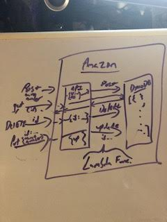

### LAB - Class 18

## Project: AWS: API, Dynamo and Lambda
## Auth: Julien Edwards

### Links and Resources

## 17

- [github](https://github.com/TrunkOfUkuleles/serverless-api)
- [Post](https://ixivlmvaj8.execute-api.us-west-2.amazonaws.com/people) 
- [Get](https://5pfubkj78e.execute-api.us-west-2.amazonaws.com/people) 
- [Put](https://54jy9c13d4.execute-api.us-west-2.amazonaws.com/people) 
- [Delete](https://pc915x9fw7.execute-api.us-west-2.amazonaws.com/people) 

### Setup

#### How to initialize/run your application (where applicable)
Data shape:
{   "id": "UUID",
    "name": "EXAMPLE",
    "number": "EXAMPLE"
}

new person:
{ "body": {
    "name": "EXAMPLE",
    "number": "EXAMPLE"
    }
}

update person:
{ "body": {
    "name": "UPDATED NAME",
    "number": "UPDATED NUMBER"
    },
    "queryStringParameters": {
        "id": "TARGET ID"
    }
}

delete person:
{
    "queryStringParameters": {
        "id": "TARGET ID"
    }
}

#### Tests
ran the Lambda based tests, as well as hit the API with Postman. 

#### UML / Application Wiring Diagram

18

